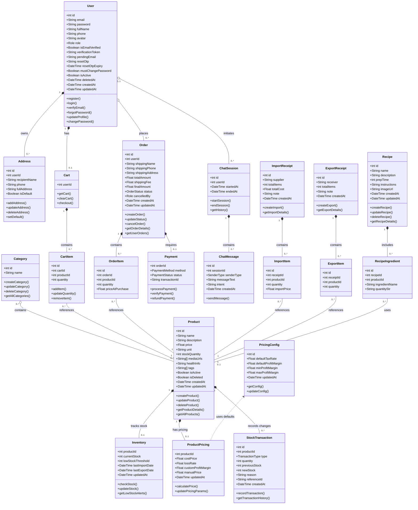

# BIỂU ĐỒ LỚP CHI TIẾT HỆ THỐNG FRUITASTE (UML CLASS DIAGRAM)

Tài liệu này chứa biểu đồ lớp (Class Diagram) chi tiết của hệ thống FruiTaste, được vẽ lại dựa trên cấu trúc các thực thể dữ liệu thực tế trong mã nguồn dự án (Prisma Schema). Biểu đồ sử dụng các ký hiệu chuẩn UML để biểu diễn mối quan hệ giữa các lớp theo đúng tinh thần học thuật và thực tiễn phát triển.

---

## 1. Quy chuẩn Ký hiệu Mối quan hệ UML sử dụng

Dựa trên cấu trúc quan hệ thực tế của các thực thể và ràng buộc toàn vẹn cơ sở dữ liệu (Database Integrity & Cascade Rules), chúng tôi áp dụng các ký hiệu liên kết chuẩn UML như sau:

| Ký hiệu UML | Tên mối quan hệ | Mô tả áp dụng trong hệ thống | Ký hiệu Mermaid |
| :---: | :--- | :--- | :---: |
| `───` | **Association (Liên kết)** | Kết nối giữa hai thực thể độc lập về vòng đời nhưng có tham chiếu dữ liệu đến nhau (ví dụ: một Chi tiết đơn hàng tham chiếu tới một Sản phẩm). | `--` |
| `◆───` | **Composition (Thuộc về hoàn toàn)** | Quan hệ sở hữu mạnh mẽ, phần con là một phần không thể tách rời và phụ thuộc hoàn toàn vào vòng đời của phần cha. Nếu cha bị xóa, con sẽ bị xóa theo (ràng buộc `onDelete: Cascade`). | `*--` |
| `◇───` | **Aggregation (Thu tụ/Thu gom)** | Quan hệ thu gom yếu, phần con có thể tồn tại độc lập với phần cha (ràng buộc `onDelete: SetNull` hoặc liên kết yếu). | `o--` |
| `- - - >` | **Dependency (Phụ thuộc)** | Một thực thể sử dụng thông tin, hàm hoặc cấu hình từ thực thể khác nhưng không lưu trữ trực tiếp dưới dạng trường quan hệ sở hữu. | `<..` |

---

## 2. Biểu đồ lớp hệ thống (Mermaid)

Dưới đây là mã nguồn và sơ đồ lớp chi tiết của hệ thống FruiTaste. Quá trình hiển thị biểu đồ được vẽ động trực tiếp thông qua thư viện Mermaid.

---

## 3. Ràng buộc & Giải thích nghiệp vụ quan hệ

### 3.3.1 Các quan hệ Thuộc về (Composition) tiêu biểu
1.  **User ➔ Address & Cart**: Mỗi địa chỉ nhận hàng (`Address`) và giỏ hàng (`Cart`) được định danh và gắn chặt với tài khoản người dùng (`User`). Khi xóa một tài khoản, toàn bộ địa chỉ và giỏ hàng tương ứng sẽ bị xóa sạch khỏi hệ thống.
2.  **Order ➔ OrderItem & Payment**: Một đơn hàng (`Order`) cấu thành từ danh sách chi tiết hàng hóa (`OrderItem`) và một yêu cầu thanh toán (`Payment`). Không thể tồn tại một chi tiết đơn hàng hay một thông tin thanh toán mồ côi nếu đơn hàng chính bị hủy bỏ về mặt cơ sở dữ liệu.
3.  **Product ➔ Inventory & ProductPricing**: Kho chứa (`Inventory`) và Cấu hình giá bán (`ProductPricing`) sử dụng trực tiếp ID của sản phẩm làm khóa chính độc lập. Điều này thể hiện Product đóng vai trò quản lý trực tiếp vòng đời của hai thực thể phụ thuộc này.

### 3.3.2 Các quan hệ Liên kết (Association)
1.  **User ➔ Order**: Liên kết giữa người dùng và đơn hàng. Dù tài khoản bị ẩn/xóa mềm (`isDeleted` hoặc `isActive = false`), thông tin đơn hàng (`Order`) vẫn cần được lưu giữ nguyên vẹn trong hệ thống cho mục đích đối soát tài chính của quản trị viên, do đó đây là liên kết thông thường chứ không phải Composition.
2.  **Category ➔ Product**: Mối quan hệ nhiều - nhiều (`n - m`). Một sản phẩm có thể nằm trong nhiều danh mục khác nhau (ví dụ: vừa thuộc danh mục *Trái cây nhập khẩu* vừa thuộc danh mục *Sản phẩm bán chạy*) và một danh mục chứa nhiều sản phẩm.

### 3.3.3 Quan hệ Phụ thuộc (Dependency)
*   **ProductPricing ➔ PricingConfig**: Lớp quản lý định giá sản phẩm (`ProductPricing`) chứa phương thức `calculatePrice()` để tính toán đề xuất giá bán tự động. Quá trình tính toán này cần tham chiếu đến các thông số thuế VAT mặc định và biên lợi nhuận sàn được lưu trữ trong lớp cấu hình chung `PricingConfig`. Đây là quan hệ phụ thuộc cấu hình (Dependency), được biểu diễn bằng mũi tên nét đứt hướng về phía `PricingConfig`.
